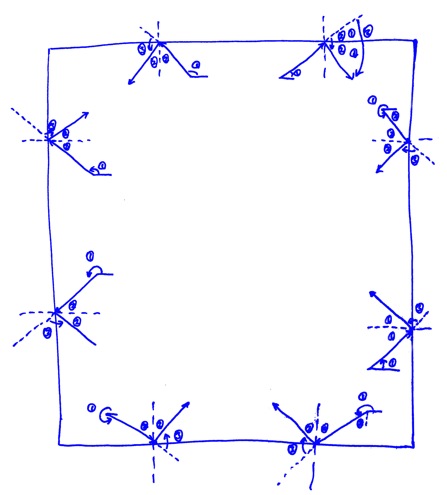

# turtle实现

## 第一步
### 实现游戏流程：

state_index  状态机：开始，游戏，失败

### 创建小球

ball = Turtle(shape='circle')

### 模拟小球反弹

## 第二步

### 创建挡板

board = Turtle(shape='square')

### 模拟挡板反弹

if x > board_x1 and x < board_x2 and y < board_y1 and y > board_y2: ...

## 第三步

### 添加计分功能

score_now = 0

score_high = 0

### 添加声音效果

from winsound import PlaySound, SND_ASYNC

PlaySound('res/pop.wav', SND_ASYNC)

